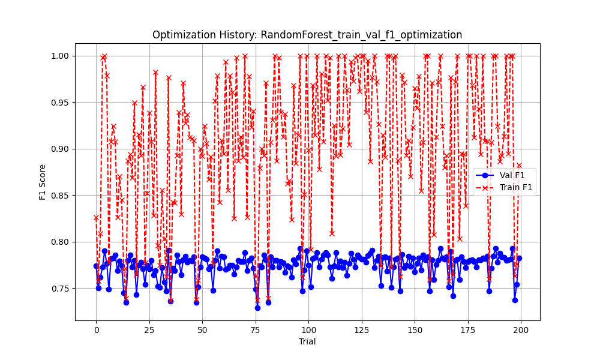
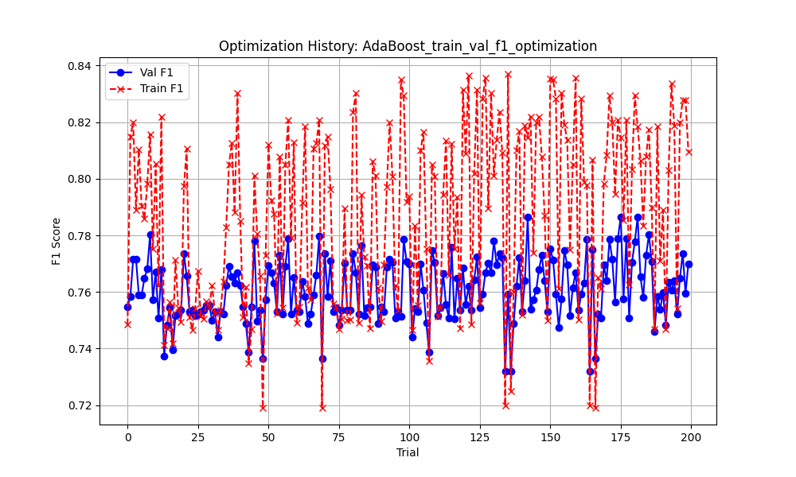
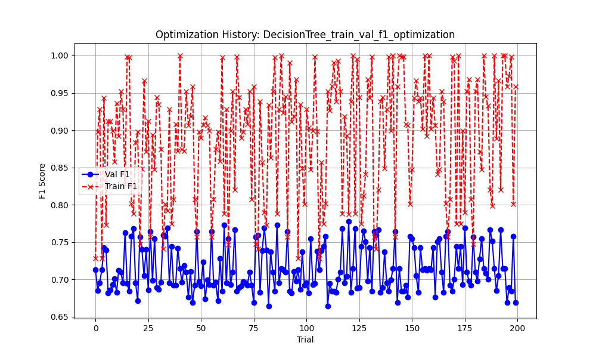
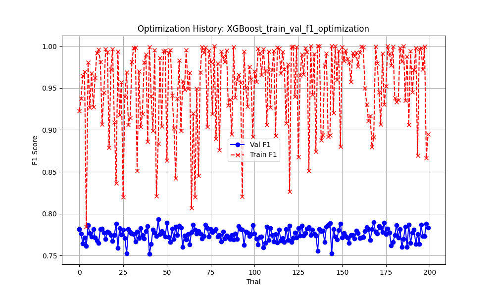

# Optuna Optimization Report

This report summarizes the best hyperparameters and performance metrics for each model optimized using Optuna.

## Study: RandomForest_train_val_f1_optimization

### 🏆 Best Consistent Trial
- **Trial ID**: #96
- **Validation F1**: 0.7926
- **Train F1**: 1.0000
- **Overfitting Gap**: 0.2074

### ⚙️ Best Hyperparameters
```json
{
    "n_estimators": 200,
    "max_depth": 20,
    "min_samples_leaf": 1
}
```

### 📈 Optimization History


## Study: AdaBoost_train_val_f1_optimization

### 🏆 Best Consistent Trial
- **Trial ID**: #181
- **Validation F1**: 0.7866
- **Train F1**: 0.8184
- **Overfitting Gap**: 0.0318

### ⚙️ Best Hyperparameters
```json
{
    "n_estimators": 199,
    "learning_rate": 0.6875761512492462
}
```

### 📈 Optimization History


## Study: DecisionTree_train_val_f1_optimization

### 🏆 Best Consistent Trial
- **Trial ID**: #120
- **Validation F1**: 0.7782
- **Train F1**: 0.7877
- **Overfitting Gap**: 0.0096

### ⚙️ Best Hyperparameters
```json
{
    "max_depth": 5,
    "min_samples_leaf": 5,
    "criterion": "gini"
}
```

### 📈 Optimization History


## Study: XGBoost_train_val_f1_optimization

### 🏆 Best Consistent Trial
- **Trial ID**: #45
- **Validation F1**: 0.7934
- **Train F1**: 0.8839
- **Overfitting Gap**: 0.0905

### ⚙️ Best Hyperparameters
```json
{
    "n_estimators": 231,
    "max_depth": 3,
    "learning_rate": 0.13425614577586384,
    "subsample": 0.6995953912802577,
    "colsample_bytree": 0.9638249957164837,
    "reg_alpha": 1.1590196018946977,
    "reg_lambda": 8.01936281617245,
    "gamma": 0.7763894195513769,
    "min_child_weight": 1
}
```

### 📈 Optimization History


