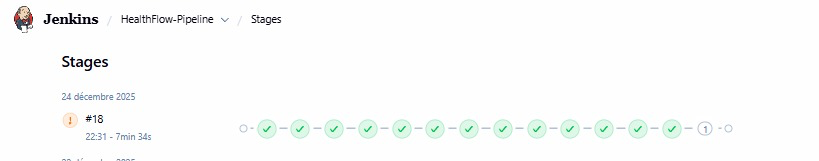

# HealthFlow-MS: FHIR Analysis and Readmission Prediction Platform

Microservices-based healthcare analytics platform for predicting patient readmission risks using FHIR data, BioBERT NLP, and XGBoost ML.

## 🚀 Quick Start

### 1. Start All Services
JENKINS


## 🎥 Project Demo

https://github.com/user-attachments/assets/663858f4-5e2b-433c-9d4a-674ba19d93c1

## 🔧 Services

| Service          | Port | Description                      |
| ---------------- | ---- | -------------------------------- |
| **Dashboard**    | 3000 | React web interface              |
| **API Gateway**  | 8080 | Spring Cloud Gateway             |
| **ProxyFHIR**    | 8081 | FHIR data integration            |
| **DeID**         | 5000 | Data anonymization               |
| **Featurizer**   | 5001 | Feature extraction + BioBERT NLP |
| **ML-Predictor** | 5002 | XGBoost risk prediction          |
| **ScoreAPI**     | 5003 | Prediction API with JWT auth     |
| **PostgreSQL**   | 5433 | Database                         |

## 🔄 CI/CD Pipeline

The project uses a Jenkins pipeline for automated building, testing, and deployment.



## 🧪 Development

### Run Individual Services

#### Python Services (DeID, Featurizer, ML-Predictor, ScoreAPI)

```bash
cd <service-directory>
python -m venv venv
source venv/bin/activate  # On Windows: venv\Scripts\activate
pip install -r requirements.txt
python app.py
```

#### Java Services (API Gateway, ProxyFHIR)

```bash
cd <service-directory>
./mvnw spring-boot:run
```

#### Dashboard (React)

```bash
cd dashboard-web
npm install
npm run dev
```

## 🎯 Real Readmission Detection

HealthFlow detects **real 30-day readmissions** from Synthea data using SQL window functions:

**Results** (1,427 patients dataset):

- ✅ **4,614 encounters** (inpatient + emergency)
- ✅ **1,553 readmissions** detected
- ✅ **33.66% readmission rate** (realistic for synthetic data)

**How it works**:

1. Extract encounters from FHIR bundles to relational tables
2. Use `LEAD()` window function to find next admission per patient
3. Flag as readmission if next admission ≤ 30 days after discharge

See [`scripts/02_detect_readmissions.sql`](scripts/02_detect_readmissions.sql) for implementation.

## 🏆 Model Performance

**XGBoost Readmission Predictor** trained on 3,607 patients with real 30-day readmissions:

### **Metrics**

- **Test Accuracy**: 81.58%
- **ROC-AUC**: 88.27%
- **Precision**: 82% (No Readmission), 80% (Readmission)
- **Recall**: 86% (No Readmission), 76% (Readmission)

### **Dataset**

- **3,607 patients** from Synthea
- **1,571 real readmissions** (43.55% rate)
- **51 features**: 37 structured + 14 NLP (BioBERT hybrid)
- **292,576 clinical notes** analyzed

### **Training Details**

- 313 iterations, best at 262
- Train AUC: 94.38%, Test AUC: 88.14%
- Minimal overfitting (gap: 6.24%)
- Training time: ~16 seconds

## 📝 Data Pipeline

### Complete Workflow (Pure SQL - Ultra-Fast!)

**Note**: All dataset filenames are **fixed** - no need to update `train.py`!

```bash
# 1. Generate synthetic patients with clinical notes
cd scripts
./generate_synthea_data.sh 1000  # Generates ~1000 patients

# 2. Load FHIR data into PostgreSQL (PARALLEL - 4x faster!)
python3 load_synthea_to_db_parallel.py synthea_output/fhir
# Alternative (sequential): python3 load_synthea_to_db.py synthea_output/fhir

# 3. Extract ALL FHIR resources to relational tables (100% SQL!)
export PGPASSWORD='qwerty'
psql -h localhost -p 5433 -U postgres -d healthflow_fhir -f extract_all_fhir_resources.sql
# → Creates: raw_observations, raw_conditions, raw_medications (2M+ records in seconds!)

# 4. Build complete dataset with readmissions (100% SQL - ultra-fast!)
psql -h localhost -p 5433 -U postgres -d healthflow_fhir -f build_dataset_pure_sql.sql
# → Creates dataset_final with 35 structured features + readmission labels

# 5. Export to CSV
psql -h localhost -p 5433 -U postgres -d healthflow_fhir -c "\COPY dataset_final TO '../dataset_structured.csv' CSV HEADER"

# 6. Extract NLP features using BioBERT Hybrid (OpenMed + Keywords)
python3 extract_biobert_features.py
# → dataset_with_nlp.csv (50 features: 35 structured + 14 NLP + 1 label)

# 7. Retrain XGBoost model (NO manual updates needed!)
cd ..
python train.py  # Automatically uses dataset_with_nlp.csv
# Expected: 80-85% accuracy with NLP features

# 8. Deploy new model to ml-predictor service
cp xgboost_readmission_model.ubj ml-predictor/
docker-compose restart ml-predictor

# 9. Populate microservice tables for dashboard (IMPORTANT!)
cd scripts
psql -h localhost -p 5433 -U postgres -d healthflow_fhir -f populate_microservice_tables.sql
# → Populates patient_features (3,607 rows) from dataset_final

# 10. Generate predictions using ML-Predictor service
curl -X POST http://localhost:8085/api/v1/predictions/predict/all
# → Creates 3,607 risk predictions using the trained XGBoost model

# 11. Access dashboard to see predictions
open http://localhost:3000
# Dashboard should now display all patient data and predictions
```

## 💾 Database Backup & Restore

**Skip the entire workflow!** Share the pre-built database with your team.

### **Create Backup** (You - once)

```bash
cd scripts
python backup_database.py
# → Creates database_backups/healthflow_db.sql.gz (1.27 GB)
# → Contains: 3,607 patients, 2M+ observations, 292K encounters
```

### **Restore Backup** (Team - instant setup)

```bash
# 1. Clone repository
git clone https://github.com/Jetaofgak/HealthFlowFinal.git
cd HealthFlowFinal

# 2. Start Docker
docker-compose up -d

# 3. Restore database (cross-platform: Windows/Mac/Linux)
cd scripts
python restore_database.py database_backups/healthflow_db.sql.gz

# 4. Ready! Skip to step 6 (NLP) or step 7 (training)
```

**Benefits**: Saves 2+ hours, identical data, cross-platform, Git LFS tracked

### Quick Workflow (Structured Features Only)

If you want to skip BioBERT and use only structured features:

```bash
# 1-3. Same as above (generate and load data)

# 4. Train with structured features only
python train.py  # Uses dataset_100k_features.csv

# 5. Deploy model
cp xgboost_readmission_model.ubj ml-predictor/
docker-compose restart ml-predictor
```

### Data Flow Diagram

```
Synthea Generator
      ↓
FHIR JSON Bundles (with clinical notes)
      ↓
load_synthea_to_db.py
      ↓
PostgreSQL (fhir_bundles + clinical_notes tables)
      ↓
extract_biobert_features.py
      ↓
BioBERT NLP Processing
      ↓
dataset_with_nlp_features.csv (35 structured + 14 NLP features)
      ↓
train.py (XGBoost)
      ↓
xgboost_readmission_model.ubj
      ↓
ML-Predictor Service
      ↓
Risk Predictions via API
```

## 🔍 Health Checks

```bash
# Check all services
curl http://localhost:5000/health  # DeID
curl http://localhost:5001/health  # Featurizer
curl http://localhost:5002/health  # ML-Predictor
curl http://localhost:5003/health  # ScoreAPI
curl http://localhost:8080/health  # API Gateway
```

## 📚 Documentation

- **Setup Guide**: [docs/SYNTHEA_SETUP.md](docs/SYNTHEA_SETUP.md)
- **Quick Start**: [docs/QUICK_START_SYNTHEA.md](docs/QUICK_START_SYNTHEA.md)
- **Project Overview**: [project.md](project.md)
- **Dashboard Issue Fix**: [PROBLEM.md](PROBLEM.md) - Troubleshooting dashboard zeros/N/A values

## ⚠️ Known Limitations

### "Sync Patients" Feature

The "Sync" button in the dashboard connects to a public FHIR server (`r4.smarthealthit.org`) for testing purposes.

**Status**: ✅ Working (small datasets only)

**Limitations**:

- The public server is rate-limited and slow
- The sync process is synchronous and may timeout for requests > 20 patients
- Designed for demonstration and testing, not for production datasets

**DNS Configuration**: The ProxyFHIR service includes Google DNS (8.8.8.8, 8.8.4.4) to ensure external connectivity from Docker containers.

**Recommended for Production**:

- **Use the local generation workflow** (`generate_synthea_data.sh`) for datasets > 20 patients
- This offline method is 100% reliable, faster, and produces better data quality with clinical notes
- Successfully tested with 1,000-10,000 patients using local generation

### Pipeline Anonymization Performance

The `/api/v1/deid/anonymize/all` endpoint is optimized for large datasets by processing only patient records.

**Optimization**:

- Anonymizes 3,607 patients in ~4 seconds
- Skips 1.86M+ observations to prevent HTTP timeout
- Observation anonymization disabled (not required for batch ML workflow)

**Note**: This optimization is for the batch processing workflow. Real-time clinical workflows requiring full GDPR/HIPAA compliance should implement batched observation processing.

### API Gateway Rate Limiting

Rate limiting has been disabled in development to prevent false 429 errors during bulk operations.

**Note**: For production deployment, implement Redis-based rate limiting or use API gateway solutions (Kong, Apigee) instead of the in-memory counter.

## 🛠️ Troubleshooting

### Services Not Starting

```bash
# View logs
docker-compose logs <service-name>

# Rebuild specific service
docker-compose build <service-name>
docker-compose up -d <service-name>
```

### Database Connection Issues

```bash
# Reset database
docker-compose down -v
docker-compose up -d postgres

# Wait for healthy status
docker-compose ps postgres
```

### CORS Errors in Dashboard

All services are configured to allow CORS from `localhost:3000`. If issues persist:

```bash
# Rebuild Python services
docker-compose build deid featurizer ml-predictor score-api
docker-compose up -d
```

### Dashboard Showing Zeros or N/A

If the dashboard displays all zeros or N/A values despite having data in the database:

**Cause**: Microservice tables (`patient_features`, `risk_predictions`) are empty

**Solution**:

```bash
# 1. Verify dataset exists
export PGPASSWORD='qwerty'
psql -h localhost -p 5433 -U postgres -d healthflow_fhir -c "SELECT COUNT(*) FROM dataset_final;"
# Should show 3,607 rows

# 2. Populate microservice tables
cd scripts
psql -h localhost -p 5433 -U postgres -d healthflow_fhir -f populate_microservice_tables.sql

# 3. Generate predictions
curl -X POST http://localhost:8085/api/v1/predictions/predict/all

# 4. Verify data
psql -h localhost -p 5433 -U postgres -d healthflow_fhir -c "
  SELECT 'patient_features', COUNT(*) FROM patient_features
  UNION ALL
  SELECT 'risk_predictions', COUNT(*) FROM risk_predictions;"
# Both should show 3,607 rows

# 5. Refresh dashboard
open http://localhost:3000
```

**See [PROBLEM.md](PROBLEM.md) for detailed explanation**

### FHIR Sync Errors (500 Internal Server Error)

If the FHIR sync endpoint fails with 500 errors:

**Common Causes**:

1. **DNS Resolution Failure**: `UnknownHostException: r4.smarthealthit.org`

   - **Solution**: Verify ProxyFHIR has DNS configured in `docker-compose.yml`:

   ```yaml
   proxy-fhir:
     dns:
       - 8.8.8.8
       - 8.8.4.4
   ```

2. **Database Constraint Violation**: `null value in column "patient_id"`

   - **Solution**: Ensure `FhirBundle` entity has `patientId` field and `saveFhirBundle` extracts it from queryParams

3. **Timeout for Large Requests**: Requests > 20 patients may timeout
   - **Solution**: Use smaller batch sizes (5-10 patients) or use local generation workflow

**Test Sync**:

```bash
# Test with small dataset
curl -X POST "http://localhost:8085/api/v1/fhir/sync/bulk?count=5"

# Should return:
# {"synced":5,"failed":0,"totalResources":~250,"status":"success"}
```

**Check Logs**:

```bash
docker-compose logs --tail=50 proxy-fhir
```

## 👥 Team

**Academic Supervisors**:

- Pr. Oumayma OUEDRHIRI (O.ouedrhiri@emsi.ma)
- Pr. Hiba TABBAA (H.Tabbaa@emsi.ma)
- Pr. Mohamed LACHGAR (lachgar.m@gmail.com)

## 📄 License

Academic project - EMSI 2026
