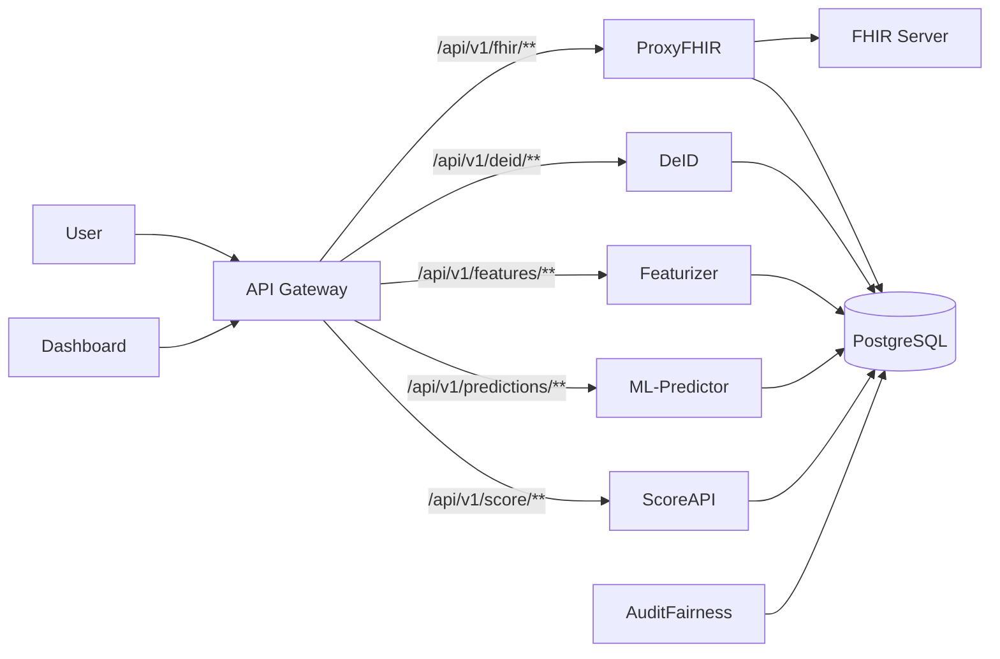

# HealthFlow-MS Architecture

This document provides a detailed overview of the microservices, technology stack, and data flow in the HealthFlow platform.

## Architecture Diagram

## Microservices Overview

### Frontend

**Dashboard Web** (Port `3000`)
A React-based Single Page Application (SPA) built with Vite and Material UI. It serves as the primary user interface for the platform.

#### Page Structure & Interactions (`App.jsx`)

1.  **Dashboard (`/`)**

    - **Component**: `Dashboard.jsx`
    - **Function**: Displays high-level real-time statistics (Total Patients, Risk Distribution).
    - **Data Source**: Calls `getStats()` in `api.js` → `API Gateway` → `ML-Predictor` & `Featurizer`.

2.  **Patient List (`/patients`)**

    - **Component**: `PatientList.jsx`
    - **Function**: A tabular view of all patients, searchable and filterable.
    - **Interaction**: specific rows can be expanded or clicked to view a `PatientCard`.
    - **Data Source**: `getPatients()` (joins features + predictions) → `API Gateway` → `ML-Predictor` (`/api/v1/predictions/patients`).

3.  **Risk Analytics (`/analytics`)**

    - **Component**: `RiskAnalytics.jsx`
    - **Function**: Deep dive into model performance (ROC-AUC) and population risk stratification.
    - **Visuals**: Pie charts and bar graphs using simple-charts library.
    - **Data Source**: `getPredictionStats()` → `ML-Predictor`.

4.  **NLP Insights (`/nlp`)**

    - **Component**: `NLPInsights.jsx`
    - **Function**: Visualizes data extracted from unstructured clinical notes (e.g., "Diabetes", "Hypertension" mentions).
    - **Visuals**: Word clouds and frequency chips.
    - **Data Source**: `getFeatures()` → `Featurizer` (`/api/v1/features/features`).

5.  **Pipeline Control (`/pipeline`)**

    - **Component**: `Pipeline.jsx`
    - **Function**: An interactive stepper interface to manually trigger each stage of the data processing pipeline.
    - **Actions**:
      1.  **Sync FHIR**: Triggers `ProxyFHIR` (`/api/v1/fhir/sync`).
      2.  **Anonymize**: Triggers `DeID` (`/api/v1/deid/anonymize`).
      3.  **Extract Features**: Triggers `Featurizer` (`/api/v1/features/extract`).
      4.  **Predict Risks**: Triggers `ML-Predictor` (`/api/v1/predictions/predict`).

6.  **Audit Fairness (`/audit-fairness`)**

    - **Component**: `AuditFairness.jsx`
    - **Function**: Displays bias detection reports generated by EvidentlyAI.
    - **Data Source**: `AuditFairness` service (`/api/v1/audit/report`).

7.  **Health Status (`/health`)**
    - **Component**: `HealthStatus.jsx`
    - **Function**: Real-time heartbeat check for all microservices.
    - **Data Source**: Hits `/health` endpoints of all services via Gateway.

### Backend Services

#### 1. API Gateway

- **Tech Stack**: Java, Spring Cloud Gateway
- **Discovery**: Uses **Docker DNS** (not Eureka). Services are addressed by their container names (e.g., `http://proxy-fhir:8081`).
- **Port**: `8080`
- **Responsibilities**:
  - Acts as the single entry point for all frontend requests.
  - Routes traffic to appropriate microservices based on URL paths (`/api/v1/*`).
  - Handles Cross-Origin Resource Sharing (CORS) configurations.

#### 2. ProxyFHIR (Integration Layer)

- **Tech Stack**: Java, Spring Boot, HAPI FHIR
- **Port**: `8081`
- **Responsibilities**:
  - Connects to external FHIR servers (e.g., hospital EHRs, SmartHealthIT) to fetch patient data.
  - Synchronizes FHIR resources (Patients, Observations, Conditions, Medications).
  - Stores raw FHIR Bundles in PostgreSQL for downstream processing.

#### 3. DeID Service (Anonymization)

- **Tech Stack**: Python, Flask, Faker
- **Port**: `5000`
- **Responsibilities**:
  - GDPR & HIPAA Compliance: Anonymizes Personal Identifiable Information (PII).
  - Replaces names, addresses, and IDs with synthetic data using the `Faker` library.
  - Implements **temporal encoding** to preserve time-based patterns while shifting actual dates.

#### 4. Featurizer Service (Feature Engineering)

- **Tech Stack**: Python, Flask, BioBERT (NLP), spaCy
- **Port**: `5001`
- **Responsibilities**:
  - Extracts 51 machine learning features from structured data and unstructured clinical notes.
  - Uses **BioBERT** models to process text from clinical notes and extract medical entities.
  - Computes statistical features from vital signs and lab results.

#### 5. ML-Predictor Service (Risk Analysis)

- **Tech Stack**: Python, Flask, XGBoost, SHAP
- **Port**: `5002`
- **Responsibilities**:
  - Loads the pre-trained XGBoost model (`xgboost_readmission_model.ubj`).
  - Predicts the probability of 30-day readmission for each patient.
  - Generates **SHAP values** to explain _why_ a specific risk score was assigned (local interpretability).

#### 6. ScoreAPI (External API)

- **Tech Stack**: Python, FastAPI, JWT
- **Port**: `5003`
- **Responsibilities**:
  - Provides a secure, high-performance REST API for external consumers.
  - Exposes risk scores and explanations.
  - Implements JWT-based authentication for secure access.

#### 7. AuditFairness (Fairness Monitoring)

- **Tech Stack**: Python, EvidentlyAI, Dash
- **Responsibilities**:
  - Monitors the ML model for bias and drift.
  - Generates reports on model fairness across different demographic groups (age, gender, ethnicity).
  - Ensures the model remains equitable and compliant with ethical AI standards.

### Data Storage

- **PostgreSQL** (Port `5433`)
  - Centralized relational database serving all microservices.
  - **Schemas/Tables**:
    - `fhir_bundles`: Raw JSON data from ProxyFHIR.
    - `fhir_resources_anonymized`: De-identified patient records.
    - `patient_features`: Extracted features ready for ML.
    - `risk_predictions`: Model outputs and risk probabilities.

## Service Discovery (No Eureka)

Unlike complex Spring Cloud setups that use **Netflix Eureka** for service discovery, this project utilizes **Docker's built-in DNS service discovery**.

- **Mechanism**: All services run in the same Docker network (`default`).
- **Addressing**: Services communicate using their container names as hostnames.
  - Example: API Gateway routes to `http://proxy-fhir:8081` simply by referring to `proxy-fhir`.
- **Benefit**: Reduces architectural complexity and resource overhead for a defined microservices cluster.

## Data Pipeline Flow

The HealthFlow platform follows a linear data processing pipeline:

1.  **Ingestion**: `ProxyFHIR` fetches raw FHIR bundles from the source system and saves them to the database.
2.  **Anonymization**: `DeID` reads raw bundles, strips PII, applies temporal shifting, and saves anonymized records.
3.  **Feature Extraction**: `Featurizer` reads anonymized data, applies NLP (BioBERT) to notes and strict logic to structured fields, producing a feature vector.
4.  **Prediction**: `ML-Predictor` reads feature vectors, runs the XGBoost inference, and writes risk scores and SHAP explanations to the database.
5.  **Visualization**: The `Dashboard` queries the database (via Gateway) to display the final results to the clinician.

## Jenkins CI/CD Pipeline

The project uses a comprehensive Jenkins pipeline defined in `Jenkinsfile` to automate building, testing, and deployment.

### Pipeline Stages

1.  **Checkout**: Pulls the latest code from the GitHub repository (`main` branch).
2.  **Build Java Services**: Compiles and packages `api-gateway` and `proxy-fhir` using Maven. Artifacts are archived.
3.  **Build React Frontend**: Installs dependencies and builds the `dashboard-web` project using `npm`. Distributables are archived.
4.  **Validate Python Services**: Checks for the existence of `requirements.txt` in all Python microservices (`deID`, `featurizer`, `ml-predictor`, `score-api`, `audit-fairness`).
5.  **Run Tests**:
    - **Java**: Runs JUnit tests via `./mvnw test`.
    - **Frontend**: Runs linting via `npm run lint`.
6.  **Build Docker Images**: Builds Docker images for all services (Java, Python, Frontend) in parallel.
7.  **Push Docker Images**: Pushes tagged images to Docker Hub (`docker.io/taoufikjeta/...`). Images are tagged with the build number and commit hash, as well as `latest`.
8.  **Deploy**:
    - Updates `docker-compose-joblib.yml` with the new image tags.
    - Pulls the new images.
    - Restarts the services using `docker-compose up -d`.
9.  **Health Check**: Verifies that all deployed services are running and responding with HTTP 200 OK.
