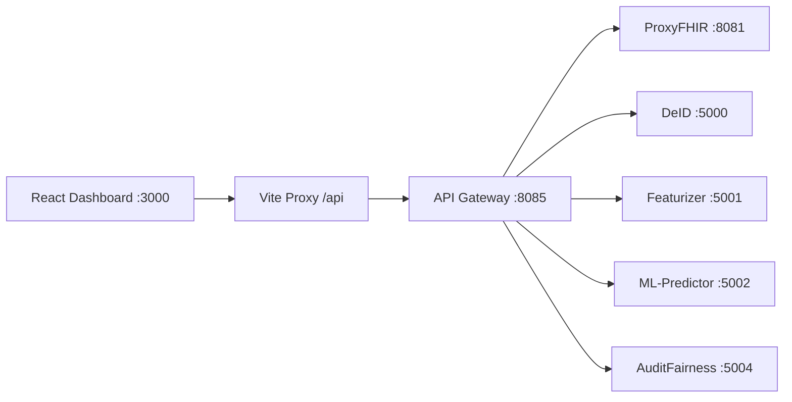

# Design: Dashboard-Microservices Integration

## Context

The `dashboard-web` application requires fixes to be fully functional with the backend microservices. Currently, components connect directly to individual service ports instead of routing through the API Gateway.

---

## Component Analysis

| Page           | Component           | Current Status | Root Cause             |
| -------------- | ------------------- | -------------- | ---------------------- |
| Dashboard      | `Dashboard.jsx`     | ⚠️ Partial     | Direct port calls      |
| Patients       | `PatientList.jsx`   | ⚠️ Partial     | Direct port calls      |
| Risk Analytics | `RiskAnalytics.jsx` | ⚠️ Partial     | Direct port calls      |
| Audit Fairness | `AuditFairness.jsx` | ❌ Mock Only   | No backend integration |
| NLP Insights   | `NLPInsights.jsx`   | ⚠️ Partial     | Direct port calls      |
| Data Pipeline  | `Pipeline.jsx`      | ⚠️ Wrong Port  | Uses 8080 vs 8085      |

---

## API Gateway Routes (port 8085)

```yaml
/api/v1/fhir/**      → ProxyFHIR (8081)
/api/v1/deid/**      → DeID (5000)
/api/v1/features/**  → Featurizer (5001)
/api/v1/predictions/** → ML-Predictor (5002)
/api/v1/scores/**    → ScoreAPI (5003)
/api/v1/audit/**     → AuditFairness (5004)
```

---

## Required Changes

### 1. `api.js` - Centralize Gateway Routing

- Remove hardcoded ports (5000, 5001, 5002, 8081)
- Use single `GATEWAY_URL = 'http://localhost:8085'`
- Update all endpoints with correct namespaced paths

### 2. `Pipeline.jsx` - Fix API URL

- Change `API_BASE_URL` from `8080` to `8085`

### 3. `AuditFairness.jsx` - Add Real API

- Add `getAuditMetrics()` call to `/api/v1/audit/metrics`
- Keep mock data as fallback

---

## Data Flow (After Fix)



---

## Verification

1. `npm run build` - No errors
2. All pages load data via Gateway
3. Network tab shows requests to `:8085` or `:3000/api`
